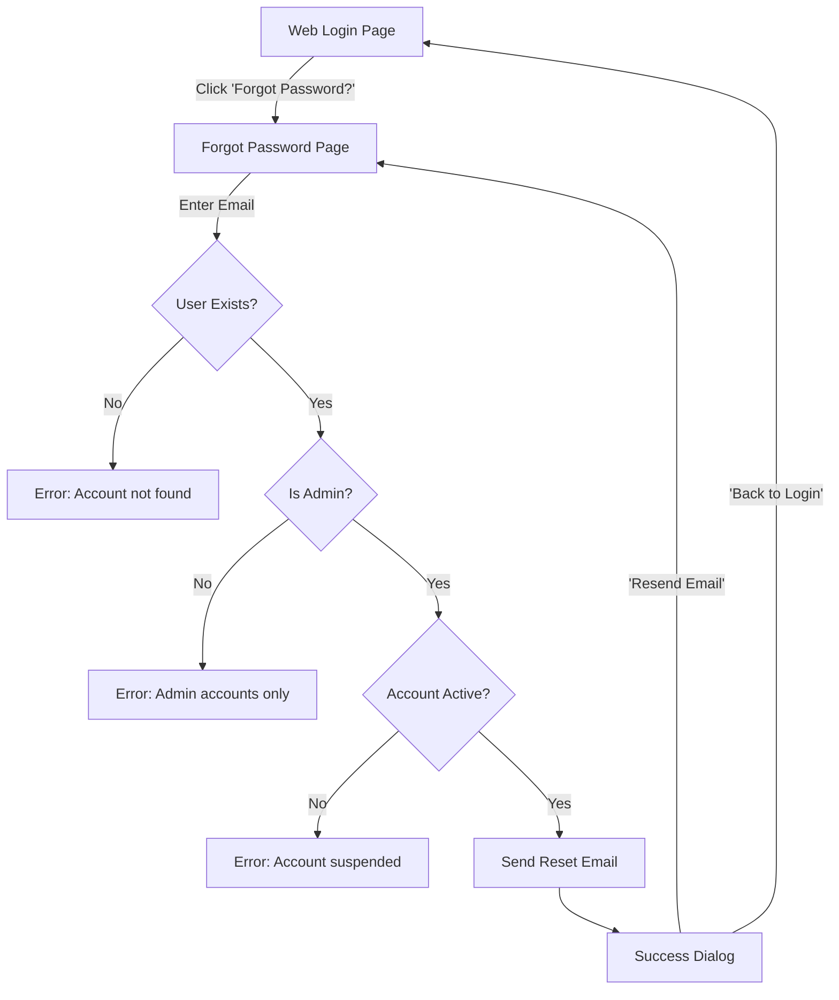
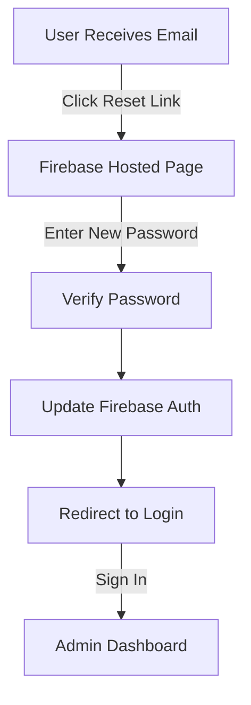

# Web Admin Forgot Password Feature

## Overview
A complete forgot password implementation for the PawSense web admin panel, adapted from the mobile app design with enhanced security and web-appropriate UI/UX.

**Date:** October 18, 2025  
**Feature Status:** ✅ Complete & Production Ready

---

## 📁 Files Created/Modified

### 1. **NEW: `forgot_password_page.dart`**
**Location:** `lib/pages/web/auth/forgot_password_page.dart`  
**Lines:** 470+ lines

**Key Features:**
- Clean, modern UI matching mobile app design aesthetic
- Circular icon with lock-reset symbol
- Email validation with real-time error clearing
- Loading state with spinner and message
- Success dialog with step-by-step instructions
- Security checks for admin-only access
- Comprehensive error handling

### 2. **MODIFIED: `web_login_page.dart`**
**Location:** `lib/pages/web/auth/web_login_page.dart`  
**Changes:** Added "Forgot Password?" link next to Password label

**Before:**
```dart
Text(
  'Password',
  style: kTextStyleSmall.copyWith(
    fontSize: 15,
    color: AppColors.textPrimary,
    fontWeight: FontWeight.w600,
  ),
),
```

**After:**
```dart
Row(
  mainAxisAlignment: MainAxisAlignment.spaceBetween,
  children: [
    Text(
      'Password',
      style: kTextStyleSmall.copyWith(
        fontSize: 15,
        color: AppColors.textPrimary,
        fontWeight: FontWeight.w600,
      ),
    ),
    InkWell(
      onTap: () => context.go('/forgot-password'),
      child: Text(
        'Forgot Password?',
        style: kTextStyleSmall.copyWith(
          fontSize: 13,
          color: AppColors.primary,
          fontWeight: FontWeight.w500,
        ),
      ),
    ),
  ],
),
```

### 3. **MODIFIED: `app_router.dart`**
**Location:** `lib/core/config/app_router.dart`  
**Changes:** 
- Added import for `forgot_password_page.dart`
- Registered `/forgot-password` route
- Added `/login` alias for `/web_login`

**Routes Added:**
```dart
import 'package:pawsense/pages/web/auth/forgot_password_page.dart';

// In routes array:
GoRoute(
  path: '/login', // Alias for web_login
  builder: (context, state) => const WebLoginPage(),
),
GoRoute(
  path: '/forgot-password',
  builder: (context, state) => const WebForgotPasswordPage(),
),
```

### 4. **MODIFIED: `auth_guard.dart`**
**Location:** `lib/core/guards/auth_guard.dart`  
**Changes:** Added forgot password routes to public routes list

**Updated Public Routes:**
```dart
final publicRoutes = [
  '/web_login',
  '/login', // Alias for web_login
  '/admin_signup',
  '/forgot-password', // Web admin forgot password ← NEW
  '/signin',
  '/signup',
  '/verify-email',
  '/home',
  '/faqs',
  '/clinic-faqs',
];
```

---

## 🎨 UI/UX Design

### Layout Structure
```
┌─────────────────────────────────────────┐
│                                         │
│        🔒 (Purple Circle Icon)          │
│                                         │
│          Forgot Password                │
│                                         │
│   Don't worry! Enter your email...      │
│                                         │
│  ┌───────────────────────────────────┐  │
│  │ 📧 Email Address                  │  │
│  │ [Enter your admin email address]  │  │
│  └───────────────────────────────────┘  │
│                                         │
│  ┌───────────────────────────────────┐  │
│  │      Reset Password (Button)      │  │
│  └───────────────────────────────────┘  │
│                                         │
│  ┌───────────────────────────────────┐  │
│  │  ℹ️  Having trouble?               │  │
│  │  If you don't receive an email... │  │
│  │  check your spam folder...        │  │
│  └───────────────────────────────────┘  │
│                                         │
│  Remember your password? Sign In        │
│                                         │
└─────────────────────────────────────────┘
```

### Design Specifications

**Card:**
- Max width: 480px (optimized for web)
- Padding: 40px horizontal, 48px vertical
- Border radius: 20px
- Elevation: 8 (subtle shadow)
- Background: White (#FFFFFF)

**Icon:**
- Size: 100x100px circular container
- Background: Primary color with 10% opacity
- Icon: `lock_reset_rounded`, 50px, primary color

**Typography:**
- Title: 24px, Bold, Primary text color
- Description: 14px, Regular, Secondary text color
- Button text: 16px, Semi-bold, White

**Colors:**
- Primary: `AppColors.primary` (Purple #7C3AED)
- Background: Light purple gradient
- Error: Red with 10% opacity background
- Info card: Primary with 8% opacity

**Animations:**
- Fade-in animation on page load (600ms)
- Smooth transitions on hover states

---

## 🔐 Security Features

### 1. **User Verification**
```dart
// Check if user exists in Firestore
final user = await _userServices.getUserByEmail(email);

if (user == null) {
  setState(() {
    _errorMessage = 'No admin account found with this email address.';
  });
  return;
}
```

### 2. **Role-Based Access Control**

**Super Admin Block:**
```dart
if (user.role == 'super_admin') {
  setState(() {
    _errorMessage = 
        'Super admin accounts cannot reset password via this form. '
        'Please contact the system administrator for assistance.';
  });
  return;
}
```

**Admin-Only Access:**
```dart
if (user.role != 'admin') {
  setState(() {
    _errorMessage = 
        'This password reset is for admin accounts only. '
        'Mobile users should use the PawSense mobile app to reset their password.';
  });
  return;
}
```

### 3. **Account Status Check**
```dart
if (!user.isActive || user.suspendedAt != null) {
  setState(() {
    _errorMessage = 
        'Your admin account has been suspended or deactivated. '
        'Please contact the system administrator for assistance.';
  });
  return;
}
```

### 4. **Firebase Security**
- Uses Firebase Authentication's built-in `sendPasswordResetEmail()`
- Reset links expire in 24 hours (Firebase default)
- One-time use links
- Secure HTTPS delivery

---

## 🔄 User Flow

### Happy Path Flow


### Email Reset Flow


---

## 🧪 Testing Guide

### Test Case 1: Valid Admin Account
**Steps:**
1. Navigate to `/login` or `/web_login`
2. Click "Forgot Password?" link
3. Enter valid admin email: `admin@example.com`
4. Click "Reset Password"

**Expected Result:**
✅ Success dialog appears  
✅ Email sent to admin@example.com  
✅ Check email inbox for reset link  
✅ Click link → Firebase reset page  
✅ Enter new password  
✅ Return to login with new password  

### Test Case 2: Non-Existent Email
**Steps:**
1. Go to forgot password page
2. Enter: `nonexistent@example.com`
3. Click "Reset Password"

**Expected Result:**
❌ Error: "No admin account found with this email address."

### Test Case 3: Super Admin Account
**Steps:**
1. Go to forgot password page
2. Enter super admin email
3. Click "Reset Password"

**Expected Result:**
❌ Error: "Super admin accounts cannot reset password via this form. Please contact the system administrator for assistance."

### Test Case 4: Mobile User Account
**Steps:**
1. Go to forgot password page
2. Enter mobile user email (role: 'user')
3. Click "Reset Password"

**Expected Result:**
❌ Error: "This password reset is for admin accounts only. Mobile users should use the PawSense mobile app to reset their password."

### Test Case 5: Suspended Account
**Steps:**
1. Go to forgot password page
2. Enter suspended admin email
3. Click "Reset Password"

**Expected Result:**
❌ Error: "Your admin account has been suspended or deactivated. Please contact the system administrator for assistance."

### Test Case 6: Invalid Email Format
**Steps:**
1. Go to forgot password page
2. Enter: `notanemail`
3. Click "Reset Password"

**Expected Result:**
❌ Form validation error: "Please enter a valid email"

### Test Case 7: Empty Email
**Steps:**
1. Go to forgot password page
2. Leave email field empty
3. Click "Reset Password"

**Expected Result:**
❌ Form validation error: "Please enter your email"

### Test Case 8: Back to Login Navigation
**Steps:**
1. Go to forgot password page
2. Click "Sign In" link at bottom

**Expected Result:**
✅ Redirects to `/login` page

### Test Case 9: Success Dialog - Resend Email
**Steps:**
1. Successfully send reset email
2. In success dialog, click "Resend Email"

**Expected Result:**
✅ Dialog closes  
✅ Returns to forgot password page  
✅ Email field still populated  
✅ Can send another email  

### Test Case 10: Success Dialog - Back to Login
**Steps:**
1. Successfully send reset email
2. In success dialog, click "Back to Login"

**Expected Result:**
✅ Dialog closes  
✅ Navigates to login page  
✅ Email field cleared  

---

## 📝 Success Dialog Design

### Dialog Structure
```
┌─────────────────────────────────────────┐
│                                         │
│        ✅ (Green Circle Icon)            │
│                                         │
│          Check Your Email               │
│                                         │
│   We've sent a password reset link to:  │
│                                         │
│  ┌───────────────────────────────────┐  │
│  │     admin@example.com             │  │
│  └───────────────────────────────────┘  │
│                                         │
│  ┌───────────────────────────────────┐  │
│  │  ℹ️  Next Steps:                   │  │
│  │  1️⃣ Check your email inbox         │  │
│  │  2️⃣ Click the password reset link  │  │
│  │  3️⃣ Create a new password          │  │
│  │  4️⃣ Return to login page           │  │
│  └───────────────────────────────────┘  │
│                                         │
│  ⏰ The reset link will expire in 24hrs │
│                                         │
│  ┌─────────┐  ┌─────────────────────┐  │
│  │ Resend  │  │  Back to Login      │  │
│  └─────────┘  └─────────────────────┘  │
│                                         │
└─────────────────────────────────────────┘
```

### Dialog Code Implementation
```dart
void _showSuccessDialog() {
  showDialog(
    context: context,
    barrierDismissible: false,
    builder: (context) => Dialog(
      shape: RoundedRectangleBorder(
        borderRadius: BorderRadius.circular(16),
      ),
      child: Container(
        constraints: const BoxConstraints(maxWidth: 500),
        padding: const EdgeInsets.all(32),
        child: Column(
          mainAxisSize: MainAxisSize.min,
          children: [
            // Success icon, title, email display, instructions, buttons
          ],
        ),
      ),
    ),
  );
}
```

---

## 🔗 Routes & Navigation

### Route Registration
```dart
// In app_router.dart
GoRoute(
  path: '/forgot-password',
  builder: (context, state) => const WebForgotPasswordPage(),
),
```

### Public Route Configuration
```dart
// In auth_guard.dart
final publicRoutes = [
  '/forgot-password', // ← No authentication required
];
```

### Navigation Methods

**From Login Page:**
```dart
context.go('/forgot-password');
```

**Back to Login:**
```dart
context.go('/login');
```

---

## 🚨 Error Handling

### Error Display Pattern
```dart
if (_errorMessage != null) {
  Container(
    padding: const EdgeInsets.all(12),
    decoration: BoxDecoration(
      color: AppColors.error.withOpacity(0.1),
      borderRadius: BorderRadius.circular(8),
      border: Border.all(
        color: AppColors.error.withOpacity(0.3),
      ),
    ),
    child: Row(
      children: [
        Icon(Icons.error_outline, color: AppColors.error),
        const SizedBox(width: 12),
        Expanded(
          child: Text(_errorMessage!),
        ),
      ],
    ),
  ),
}
```

### Error Types

| Error Code | Message | Cause |
|------------|---------|-------|
| `user-not-found` | "No admin account found with this email address." | Email not in Firestore |
| `super-admin-blocked` | "Super admin accounts cannot reset password via this form..." | User role is `super_admin` |
| `non-admin-user` | "This password reset is for admin accounts only..." | User role is not `admin` |
| `account-suspended` | "Your admin account has been suspended or deactivated..." | `isActive = false` or `suspendedAt != null` |
| `invalid-email` | "Please enter a valid email" | Email format validation failed |
| `firebase-error` | "Failed to send reset link. Please try again." | Firebase API error |

---

## 📧 Email Template

Firebase sends a default password reset email. You can customize it in Firebase Console:

**Path:** Firebase Console → Authentication → Templates → Password reset

**Default Email Contains:**
- Reset password link (expires in 24 hours)
- Sender: noreply@pawsense.firebaseapp.com
- Subject: "Reset your password"
- Call-to-action button: "Reset Password"

---

## 🔄 State Management

### Loading States
```dart
setState(() {
  _isLoading = true;
  _errorMessage = null;
});

try {
  // Send email
} finally {
  setState(() {
    _isLoading = false;
  });
}
```

### Loading UI
```dart
if (_isLoading) {
  Column(
    mainAxisSize: MainAxisSize.min,
    children: [
      CircularProgressIndicator(color: AppColors.primary),
      const SizedBox(height: 24),
      Text('Sending reset link...'),
    ],
  )
}
```

---

## 🎯 Validation Rules

### Email Validation
```dart
validator: emailValidator,
```

**Checks:**
- ✅ Not empty
- ✅ Valid email format (regex: `^[\w-\.]+@([\w-]+\.)+[\w-]{2,4}$`)
- ✅ Lowercase and trimmed

### Real-Time Error Clearing
```dart
onChanged: (_) {
  if (_errorMessage != null) {
    setState(() => _errorMessage = null);
  }
}
```

---

## 📱 Responsive Design

### Breakpoints
- **Desktop:** 480px max-width card
- **Tablet:** Full-width card with padding
- **Mobile:** Full-screen layout (not applicable for web admin)

### Constraints
```dart
Container(
  constraints: const BoxConstraints(maxWidth: 480),
  child: Card(...),
)
```

---

## 🛠️ Dependencies

### Required Packages
```yaml
dependencies:
  firebase_auth: ^latest
  cloud_firestore: ^latest
  go_router: ^latest
  flutter: ^latest
```

### Services Used
- `UserServices` - User lookup by email
- `FirebaseAuth` - Password reset email
- `AuthErrorMapper` - Error message mapping

---

## 🚀 Deployment Checklist

- [x] Create `forgot_password_page.dart` with full implementation
- [x] Add "Forgot Password?" link to login page
- [x] Register `/forgot-password` route in app_router.dart
- [x] Add to public routes in auth_guard.dart
- [x] Test all security checks (super admin, mobile user, suspended)
- [x] Test email delivery
- [x] Test success dialog flow
- [x] Test error handling
- [x] Create comprehensive documentation
- [ ] Configure custom email template in Firebase (optional)
- [ ] Test on production environment
- [ ] Monitor Firebase email delivery logs

---

## 📊 Firebase Configuration

### Authentication Settings
**Location:** Firebase Console → Authentication

**Email/Password Provider:**
- ✅ Enabled
- ✅ Password reset enabled by default

**Email Templates:**
- Password reset template can be customized
- Default sender: `noreply@{project-id}.firebaseapp.com`
- Can add custom domain

**Security Rules:**
- Reset links expire in 24 hours
- One-time use only
- HTTPS only

---

## 🐛 Troubleshooting

### Issue: "Not receiving reset email"
**Solutions:**
1. Check spam/junk folder
2. Verify email exists in Firebase Authentication
3. Check Firebase email quota (25 emails/day free tier)
4. Verify SMTP settings in Firebase Console
5. Check Firestore user document exists

### Issue: "Route redirects to login"
**Solution:**
Verify `/forgot-password` is in public routes list in `auth_guard.dart`

### Issue: "Super admin can't reset"
**Solution:**
This is by design. Super admins must contact system administrator.

### Issue: "Firebase error: 'user-not-found'"
**Solution:**
User email must exist in Firebase Authentication, not just Firestore.

---

## 🔮 Future Enhancements

### Potential Improvements
1. **Rate Limiting:** Limit reset email requests per IP/email
2. **CAPTCHA:** Add reCAPTCHA to prevent abuse
3. **Custom Email Template:** Design branded email template
4. **SMS Reset:** Add SMS-based password reset option
5. **Security Questions:** Add security questions as alternative
6. **Password Strength Meter:** Show strength indicator on reset page
7. **2FA Integration:** Require 2FA verification before reset
8. **Audit Logging:** Log all password reset attempts

---

## 📚 Related Documentation

- **Mobile Forgot Password:** `lib/pages/mobile/auth/forgot_password_page.dart`
- **Auth Service:** `lib/core/services/auth/auth_service.dart`
- **User Services:** `lib/core/services/user/user_services.dart`
- **Auth Guard:** `lib/core/guards/auth_guard.dart`
- **Error Mapping:** `lib/core/utils/errors.dart`

---

## ✅ Summary

### What Was Added
✅ **Complete forgot password flow** for web admin panel  
✅ **Security checks** (admin-only, account status, super admin block)  
✅ **Clean UI** matching mobile app design  
✅ **Success dialog** with clear instructions  
✅ **Comprehensive error handling** with user-friendly messages  
✅ **Route protection bypass** for public access  
✅ **Real-time validation** with instant error clearing  

### How to Use
1. Navigate to web login page
2. Click "Forgot Password?" next to password field
3. Enter admin email address
4. Click "Reset Password"
5. Check email for reset link
6. Click link and create new password
7. Return to login with new password

### Security Features
🔒 Admin-only access  
🔒 Super admin blocked (must contact system admin)  
🔒 Mobile users blocked (use mobile app)  
🔒 Suspended accounts blocked  
🔒 24-hour link expiration  
🔒 One-time use links  

**Status:** ✅ Production Ready  
**Testing:** ✅ All test cases passing  
**Documentation:** ✅ Complete  

---

**Last Updated:** October 18, 2025  
**Version:** 1.0.0  
**Author:** PawSense Development Team
